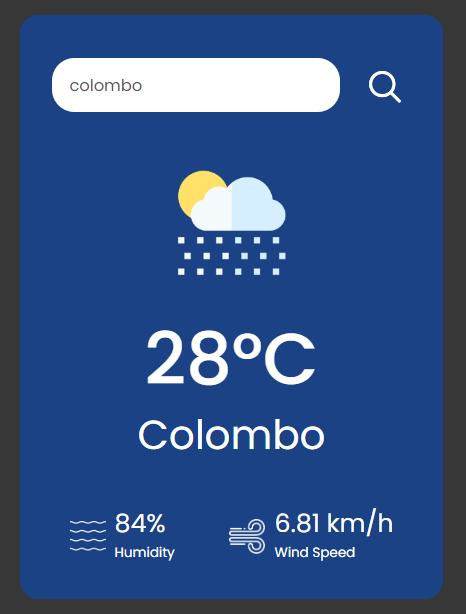
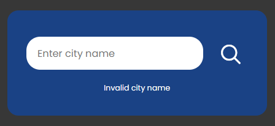

# Weather App

This is a simple Weather App built using **HTML**, **CSS**, and **JavaScript**. The app fetches weather data from a public API and displays the current weather information for a given location.

## Features

- Fetches current weather data using a weather API
- Displays temperature, humidity, and wind speed
- User can search for weather information by city name

## Technologies Used

- **HTML**
- **CSS**
- **JavaScript**
- **Weather API** (e.g., OpenWeatherMap)

## Preview

